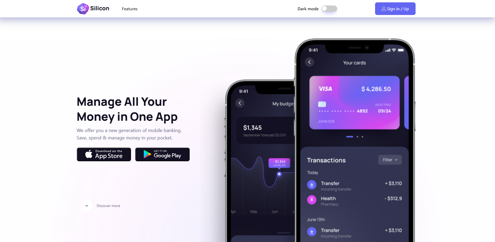

# Silicon Design

## Table of Contents

- [Introduction](#introduction)
- [Features](#features)
- [Screenshots](#screenshots)

## Introduction

This project involves transforming a design template named "Silicon Design" from Figma into a fully structured webpage using HTML and CSS. The primary task is to implement the visual structure and layout.
For this submission, I have completed the layout of the page using HTML and CSS, while leaving more dynamic functionalities for later when Javascript course is introduced.

## Features

- HTML Structure: Organizing elements like navigation bars, sections, footers, and more
- CSS Styling: Applied CSS to style the layout according to the given design, understanding how to use CSS properties to achieve visual designs for different components
- SCSS: Wrote more organized, maintainable, and reusable CSS code, leveraging variables, nesting, and mixins to streamline my styling by following 7-1 pattern (https://sass-guidelin.es/#the-7-1-pattern)
- Mobile-First Approach: Explored how to design mobile-friendly layouts first before scaling up to larger screen sizes.
- Responsiveness: Learned how to create responsive layouts for desktop, tablet, and mobile views, making the website adaptable to different screen sizes using media queries.
- Frameworks: Explored implementation of Bootstrap to have better understanding or different pre-built components and utility classes
- Design Flexibility: How to adapt the provided design to HTML/CSS code, allowing for minor differences while ensuring the overall layout stays faithful to the original Figma design.
- Understanding Themes: Implemented light and dark theme for the webpage, adhering to the visual guidelines of a modern user interface design.

## Screenshot

